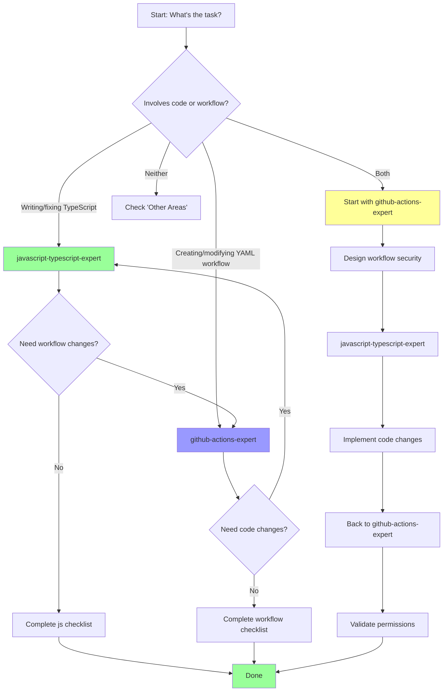

# Agent Decision Matrix

Quick reference for selecting the right agent for your task.

---

## Simple Decision Tree

```
Are you changing code in src/ ?
├─ YES → javascript-typescript-expert
└─ NO
   └─ Are you changing files in .github/workflows/ ?
      ├─ YES → github-actions-expert
      └─ NO → See "Other Areas" below
```

---

## Detailed Matrix

| Task | Primary Agent | Secondary Agent | Notes |
|------|---------------|-----------------|-------|
| **Code Development** |
| Fix bug in TypeScript code | javascript-typescript-expert | - | Check Common Issues first |
| Add new API integration | javascript-typescript-expert | - | Review GitHub API patterns |
| Refactor async functions | javascript-typescript-expert | - | Follow async/await patterns |
| Optimize API calls | javascript-typescript-expert | github-actions-expert | JS for code, Workflow for caching |
| Add error handling | javascript-typescript-expert | - | Review error handling section |
| Update TypeScript interfaces | javascript-typescript-expert | - | Check type safety patterns |
| **Workflow Configuration** |
| Create new workflow | github-actions-expert | javascript-typescript-expert | Workflow first, then action code |
| Modify workflow triggers | github-actions-expert | - | Review security checklist |
| Add workflow permissions | github-actions-expert | - | CRITICAL: Security review |
| Fix CodeQL alerts | github-actions-expert | - | Check security patterns |
| Optimize workflow performance | github-actions-expert | javascript-typescript-expert | Workflow level first |
| Add concurrency control | github-actions-expert | - | Review concurrency patterns |
| **Testing** |
| Write unit tests | javascript-typescript-expert | Future: test-engineer | Use Jest patterns |
| Mock GitHub API | javascript-typescript-expert | - | Review testing strategy |
| Test workflows locally | github-actions-expert | - | Use `act` tool |
| Fix failing tests | javascript-typescript-expert | - | Check async test patterns |
| **Security** |
| Review pull_request_target usage | github-actions-expert | - | MANDATORY review |
| Handle secrets in code | javascript-typescript-expert | github-actions-expert | Both for complete review |
| Fix security vulnerabilities | javascript-typescript-expert | github-actions-expert | Depends on location |
| Review permissions | github-actions-expert | - | Principle of least privilege |
| **Build & Distribution** |
| Fix build errors | javascript-typescript-expert | - | Review build section |
| Update dependencies | javascript-typescript-expert | - | Check compatibility |
| Optimize bundle size | javascript-typescript-expert | - | ncc bundling patterns |
| Update dist/ | javascript-typescript-expert | - | Build process section |
| **Documentation** |
| API documentation | Future: documentation-specialist | javascript-typescript-expert | Code context needed |
| User guides | Future: documentation-specialist | - | Technical writing |
| Workflow examples | github-actions-expert | Future: documentation-specialist | Workflow expertise |
| Architecture diagrams | Future: documentation-specialist | javascript-typescript-expert | Code structure |
| **Pull Request Review** |
| Review TypeScript changes | javascript-typescript-expert | - | Complete PR checklist |
| Review workflow changes | github-actions-expert | - | Security focus |
| Review mixed changes | javascript-typescript-expert | github-actions-expert | Both checklists |
| **Debugging** |
| Debug action failures | javascript-typescript-expert | github-actions-expert | Check logs, then code |
| Debug workflow failures | github-actions-expert | javascript-typescript-expert | Workflow first |
| Debug API errors | javascript-typescript-expert | - | Review error handling |
| Debug permission errors | github-actions-expert | - | Check permissions section |

---

## By File Type

| File Pattern | Agent | Section to Consult |
|-------------|-------|-------------------|
| `src/**/*.ts` | javascript-typescript-expert | Type Safety, Async Patterns |
| `src/pullrequest/*.ts` | javascript-typescript-expert | GitHub API Integration |
| `src/graphql/*.ts` | javascript-typescript-expert | GraphQL Patterns |
| `.github/workflows/*.yml` | github-actions-expert | Workflow Security, Triggers |
| `action.yml` | github-actions-expert | Action Contract |
| `__tests__/**/*.test.ts` | javascript-typescript-expert | Testing Strategy |
| `package.json` | javascript-typescript-expert | Dependencies, Build Scripts |
| `tsconfig.json` | javascript-typescript-expert | TypeScript Configuration |
| `dist/index.js` | javascript-typescript-expert | Build & Distribution |
| `docs/*.md` | Future: documentation-specialist | N/A |

---

## By Error Message

| Error Message | Agent | Where to Look |
|--------------|-------|---------------|
| "Type 'X' is not assignable..." | javascript-typescript-expert | Type Safety Issues |
| "Unhandled promise rejection" | javascript-typescript-expert | Issue 1: Promise Rejection |
| "Resource not accessible by integration" | github-actions-expert | Issue 4: Permission Errors |
| "API rate limit exceeded" | javascript-typescript-expert | Issue 2: GitHub API Rate Limiting |
| "actions/untrusted-checkout/critical" | github-actions-expert | Issue 1: CodeQL Alerts |
| "No provider for..." | javascript-typescript-expert | Build Process |
| "Workflow does not have permission..." | github-actions-expert | Permissions Section |

---

## By Symptom

| Symptom | Likely Agent | Investigation Path |
|---------|--------------|-------------------|
| Workflow doesn't trigger on fork PRs | github-actions-expert | Issue 5: pull_request vs pull_request_target |
| Duplicate workflow runs | github-actions-expert | Issue 3: Concurrency Control |
| Action slow/times out | javascript-typescript-expert | Performance Considerations |
| Tests failing intermittently | javascript-typescript-expert | Async Test Patterns |
| Build fails in CI | javascript-typescript-expert | Build Process |
| CodeQL blocking PR | github-actions-expert | Security Analysis |
| PR comment not updating | javascript-typescript-expert | Comment Update Logic |

---

## Priority Matrix

### CRITICAL (Consult Immediately)

| Situation | Agent | Why Critical |
|-----------|-------|--------------|
| Using `pull_request_target` | github-actions-expert | Security vulnerability risk |
| Handling secrets in code | javascript-typescript-expert + github-actions-expert | Potential secret exposure |
| Permission errors in production | github-actions-expert | Service degradation |
| Async code without error handling | javascript-typescript-expert | Production bugs |

### HIGH (Consult Before Implementing)

| Situation | Agent | Why High Priority |
|-----------|-------|-------------------|
| New GitHub API integration | javascript-typescript-expert | Rate limits, error handling |
| New workflow trigger | github-actions-expert | Cost, efficiency |
| Refactoring core logic | javascript-typescript-expert | Breaking changes risk |
| Changing permissions | github-actions-expert | Security implications |

### MEDIUM (Consult During Development)

| Situation | Agent | Why Medium Priority |
|-----------|-------|---------------------|
| Writing tests | javascript-typescript-expert | Best practices |
| Optimizing performance | javascript-typescript-expert or github-actions-expert | Depends on bottleneck |
| Adding logging | javascript-typescript-expert | Proper @actions/core usage |

### LOW (Optional Consultation)

| Situation | Agent | Why Low Priority |
|-----------|-------|------------------|
| Fixing typos in comments | - | No agent needed |
| Updating documentation | Future: documentation-specialist | Non-code change |
| Refactoring variable names | javascript-typescript-expert | Quick checklist only |

---

## Collaboration Patterns

### Pattern 1: Feature Development

```
Task: Add new feature with workflow integration

Step 1: DESIGN
├─ javascript-typescript-expert
│  └─ Review: Architecture patterns, interfaces
└─ github-actions-expert
   └─ Review: Workflow requirements, permissions

Step 2: IMPLEMENT
├─ javascript-typescript-expert
│  └─ Follow: Async patterns, error handling
└─ github-actions-expert
   └─ Follow: Workflow security, triggers

Step 3: TEST
└─ javascript-typescript-expert
   └─ Follow: Testing strategy

Step 4: REVIEW
├─ javascript-typescript-expert checklist
└─ github-actions-expert checklist
```

### Pattern 2: Bug Fix

```
Task: Fix production bug

Step 1: IDENTIFY
└─ Determine file location → Select agent

Step 2: UNDERSTAND
└─ Agent's "Common Issues" section

Step 3: FIX
└─ Follow agent's solution pattern

Step 4: TEST
└─ Add test covering bug (agent testing section)

Step 5: PREVENT
└─ Update agent if pattern missing
```

### Pattern 3: Security Review

```
Task: Security audit

Step 1: WORKFLOW SECURITY
└─ github-actions-expert
   ├─ Check: pull_request_target usage
   ├─ Check: Permissions
   └─ Check: Secret handling

Step 2: CODE SECURITY
└─ javascript-typescript-expert
   ├─ Check: Input validation
   ├─ Check: Error messages (no secret leaks)
   └─ Check: Proper secret masking

Step 3: DEPENDENCIES
└─ javascript-typescript-expert
   └─ Check: Known vulnerabilities
```

---

## Cross-Agent Scenarios

### Scenario 1: Optimize GitHub API Usage

**Goal**: Reduce API calls from 50/PR to 5/PR

**Agent Sequence**:
1. **javascript-typescript-expert** (PRIMARY)
   - Identify: Where are API calls made?
   - Design: GraphQL batch query
   - Implement: New API pattern
   - Test: Verify correctness

2. **github-actions-expert** (SECONDARY)
   - Check: Does workflow permission need updates?
   - Verify: Rate limit headroom sufficient?
   - Optimize: Can caching reduce calls further?

**Output**: Code optimization + workflow validation

---

### Scenario 2: Add Self-Test Workflow

**Goal**: Create workflow that tests action on itself

**Agent Sequence**:
1. **github-actions-expert** (PRIMARY)
   - Design: Safe pull_request_target pattern
   - Security: CodeQL exclusion strategy
   - Permissions: Minimal necessary scope
   - Triggers: When to run?

2. **javascript-typescript-expert** (SECONDARY)
   - Verify: Action code handles self-test edge cases?
   - Check: Any code changes needed?

**Output**: Secure self-test workflow + code adjustments

---

## Agent Selection Flowchart



---

## Other Areas (Future Agents)

| Area | Future Agent | Temporary Workaround |
|------|--------------|---------------------|
| Testing strategy | test-engineer | Use javascript-typescript-expert § Testing |
| Documentation | documentation-specialist | Follow existing docs style |
| Security audit | security-compliance-specialist | Use github-actions-expert § Security |
| Performance tuning | performance-expert | Use javascript-typescript-expert § Performance |

---

## Quick Lookup Table

**"I need to..."** → **Agent to consult**

| Need | Agent |
|------|-------|
| Write async function | javascript-typescript-expert |
| Add workflow trigger | github-actions-expert |
| Fix type error | javascript-typescript-expert |
| Review pull_request_target | github-actions-expert ⚠️ CRITICAL |
| Optimize bundle size | javascript-typescript-expert |
| Add concurrency control | github-actions-expert |
| Handle GitHub API error | javascript-typescript-expert |
| Fix permission error | github-actions-expert |
| Write unit test | javascript-typescript-expert |
| Debug workflow | github-actions-expert |

---

## Remember

1. **When in doubt** → Check this matrix
2. **Security concerns** → Always consult github-actions-expert for workflows
3. **Multiple files** → Consult multiple agents in sequence
4. **Not sure?** → Start with agent's Quick Reference section

---

**Last Updated**: 2024
**Version**: 1.0.0

**Feedback**: Find this matrix unhelpful? Open issue with suggestions!
