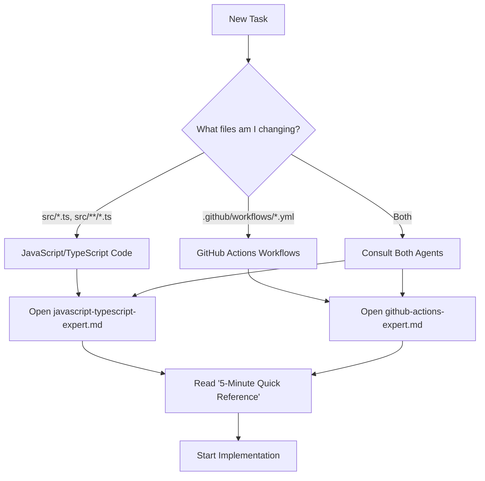
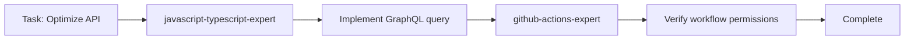
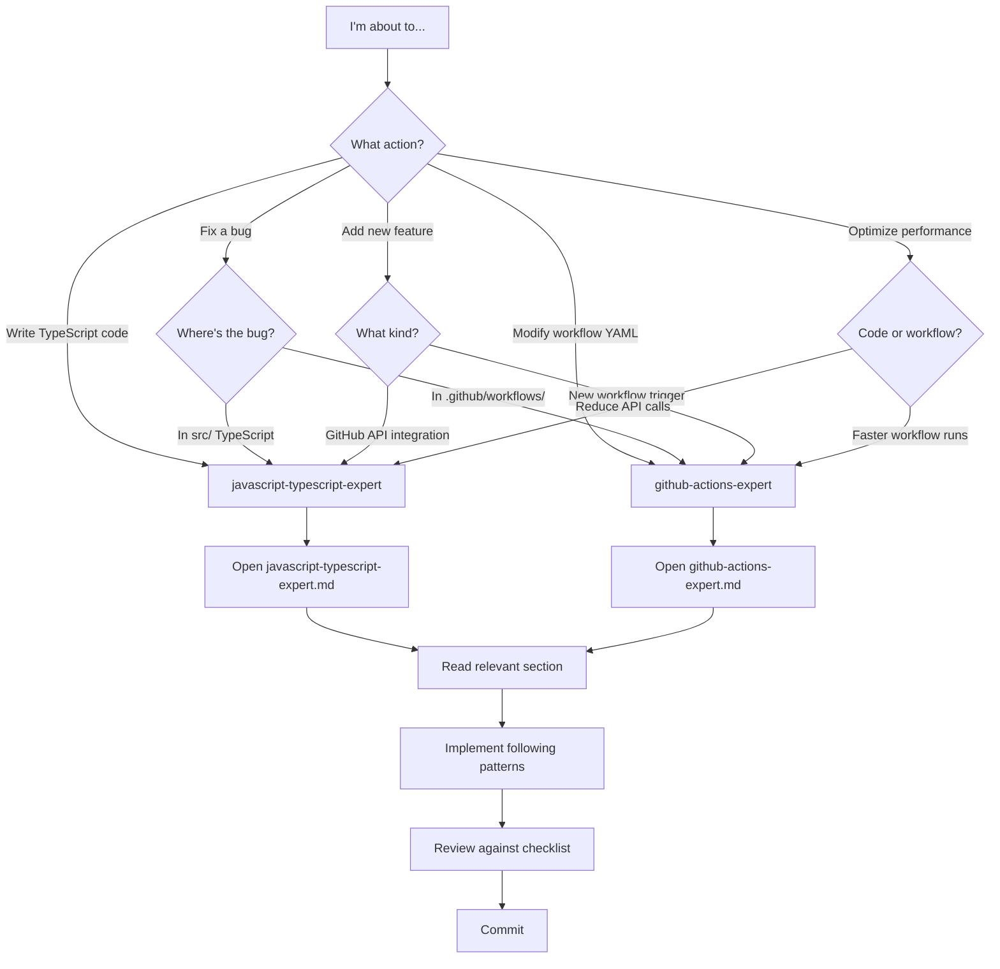

# Getting Started with Agents

**Welcome!** This guide helps you integrate specialized agents into your workflow for contributor-assistant_github-action development.

---

## Overview

Think of agents as **expert consultants** who review your work and provide guidance:

- **javascript-typescript-expert**: Reviews your TypeScript code
- **github-actions-expert**: Reviews your workflow configurations

Instead of learning everything at once, **consult agents when you need them**.

---

## Day 1: Your First Task

### Step 1: Identify Your Work Area



### Step 2: Read the Quick Reference

**Don't read the entire agent file!** Start with:

1. Open relevant agent file (e.g., `javascript-typescript-expert.md`)
2. Find **"5-Minute Quick Reference"** section
3. Read the **Pre-Flight Checklist**
4. Keep it open while you work

**Example** - TypeScript development:
```markdown
✓ Open: javascript-typescript-expert.md
✓ Find: "5-Minute Quick Reference"
✓ Review: Pre-Flight Checklist
  - [ ] TypeScript interfaces defined for all data structures
  - [ ] Async functions use proper error handling
  - [ ] No floating promises
  - [ ] Input validation using @actions/core.getInput()
  ...
```

### Step 3: Implement Following Patterns

As you code, refer to agent's **"Key Patterns & Anti-Patterns"**:

**Look for**: ✅ DO patterns (copy these)
**Avoid**: ❌ DON'T anti-patterns (don't do these)

```typescript
// ✅ DO: Proper Async Error Handling (from agent)
async function fetchSignatures(): Promise<Signature[]> {
  try {
    const response = await octokit.repos.getContent(...)
    return JSON.parse(Buffer.from(response.data.content, 'base64').toString())
  } catch (error) {
    throw new Error(`Failed to fetch signatures: ${error.message}`)
  }
}

// ❌ DON'T: Silent Promise Failures (from agent)
async function updateStatus() {
  octokit.repos.createCommitStatus(...).catch(e => console.log(e))
  // Errors swallowed!
}
```

### Step 4: Review Against Checklist

Before committing, complete the agent's **"Code Review Checklist"**:

**For TypeScript**:
```
From javascript-typescript-expert.md § Code Review Checklist:
- [ ] All functions have explicit return types
- [ ] No usage of `any`
- [ ] All promises are awaited
- [ ] Try/catch around external calls
- [ ] Error messages include context
```

**For Workflows**:
```
From github-actions-expert.md § Workflow Review Checklist:
- [ ] pull_request_target has explicit if conditions
- [ ] Permissions explicitly defined
- [ ] No execution of untrusted code
- [ ] Concurrency control defined
```

---

## Day 2-3: Deeper Dive

### Explore Common Issues

When you encounter a problem, check agent's **"Common Issues & Solutions"**:

**Example Problem**: "Unhandled promise rejection" in workflow logs

**Solution Path**:
1. Open `javascript-typescript-expert.md`
2. Search for "promise rejection"
3. Find **"Issue 1: Promise Rejection Not Handled"**
4. Apply solution pattern

### Study Code Examples

Agents include **complete code examples**:

- Copy patterns that match your use case
- Adapt to your specific needs
- Understand WHY patterns work (read explanations)

---

## Day 4-7: Mastery

### Cross-Agent Collaboration

Some tasks require **multiple agents**:

**Example Task**: Add GraphQL query to reduce API calls



**Workflow**:
1. **javascript-typescript-expert**: How to implement GraphQL, async patterns
2. **github-actions-expert**: Does workflow need updated permissions?
3. **Test** (future test-engineer): How to mock GraphQL responses

### Build Your Mental Model

**By Day 7**, you should:

- ✅ Know which agent to consult without looking at decision matrix
- ✅ Recognize patterns from agents in existing code
- ✅ Complete agent checklists quickly (muscle memory)
- ✅ Catch your own anti-patterns before committing

---

## Usage Patterns by Role

### Backend Developer (TypeScript Focus)

**Your Primary Agent**: javascript-typescript-expert

**Daily Workflow**:
1. Morning: Skim "5-Minute Quick Reference" (2 min)
2. Implementing: Keep "Key Patterns" section open
3. Stuck? Check "Common Issues & Solutions"
4. Before commit: Run "Code Review Checklist"

**Occasionally Consult**: github-actions-expert (when workflows affected)

---

### DevOps Engineer (Workflow Focus)

**Your Primary Agent**: github-actions-expert

**Daily Workflow**:
1. Planning workflow: Read "Security" checklist first
2. Implementing: Follow "Safe pull_request_target Usage" pattern
3. Optimizing: Check "Performance Optimization" section
4. Before commit: Complete "Workflow Review Checklist"

**Occasionally Consult**: javascript-typescript-expert (when action code needs changes)

---

### New Contributor (Learning)

**Start With**: Decision matrix in [README.md](README.md)

**Week 1 Plan**:
- Day 1: Read this guide + agent quick references
- Day 2-3: Make first PR following agent patterns
- Day 4-5: Review agent checklists, learn common patterns
- Day 6-7: Review another contributor's PR using agents

**Goal**: By end of week, complete agent review without help

---

## Decision Flowchart

**"Which agent do I need right now?"**



---

## Tips for Success

### ✅ DO

- **Consult agents BEFORE implementing**, not after
- **Read quick reference daily** until patterns become second nature
- **Copy agent patterns** directly (they're proven best practices)
- **Complete checklists** before every commit
- **Reference agent sections** in PR descriptions ("Followed javascript-typescript-expert § Async patterns")

### ❌ DON'T

- **Don't skip agent review** for "quick fixes" (prevents bugs)
- **Don't memorize everything** (agents are reference docs)
- **Don't ignore anti-patterns** (they exist because people made those mistakes)
- **Don't work in isolation** (agents are there to help!)

---

## Real-World Example Walkthrough

### Task: Fix Bug in Signature Validation

**Step 1: Identify Agent**
- Bug in `src/pullrequest/pullRequestComment.ts`
- TypeScript file → **javascript-typescript-expert**

**Step 2: Read Quick Reference**
```markdown
✓ Open: javascript-typescript-expert.md
✓ Find: "5-Minute Quick Reference"
✓ Note: "All promises awaited", "Error messages include context"
```

**Step 3: Review Existing Code**
```typescript
// Current code (BUG: floating promise)
async function updateAllComments(committers) {
  committers.forEach(c => updateComment(c))  // ❌ Not awaited!
}
```

**Step 4: Check Agent Patterns**
```markdown
From javascript-typescript-expert § Common Issues:

### Issue 1: Promise Rejection Not Handled
**Solution**: Always await async calls
```

**Step 5: Apply Fix**
```typescript
// Fixed code (following agent pattern)
async function updateAllComments(committers) {
  await Promise.all(committers.map(c => updateComment(c)))  // ✅ Awaited!
}
```

**Step 6: Review Checklist**
```
javascript-typescript-expert § Code Review Checklist:
✅ All promises are awaited
✅ Error messages include context
✅ Try/catch blocks around external calls
```

**Step 7: Test & Commit**
```bash
npm test            # ✅ Tests pass
npm run build       # ✅ Build succeeds
git commit -m "fix: await all comment updates

Fixes floating promise in updateAllComments
Following javascript-typescript-expert § Async patterns"
```

---

## Quick Reference Card

**Print and keep at your desk**:

```
╔══════════════════════════════════════════════════════╗
║         AGENT QUICK START                          ║
╠══════════════════════════════════════════════════════╣
║                                                    ║
║  WORKING ON:          CONSULT:                     ║
║  ─────────────────────────────────────────────     ║
║  src/*.ts            javascript-typescript-expert ║
║  workflows/*.yml     github-actions-expert        ║
║                                                    ║
║  BEFORE COMMIT:                                    ║
║  ─────────────────────────────────────────────     ║
║  1. Complete agent checklist                      ║
║  2. npm test                                       ║
║  3. npm run build                                  ║
║  4. git commit with agent reference               ║
║                                                    ║
║  STUCK?                                            ║
║  ─────────────────────────────────────────────     ║
║  → Agent's "Common Issues & Solutions"            ║
║                                                    ║
╚══════════════════════════════════════════════════════╝
```

---

## Progressive Learning Path

### Week 1: Basics
- [ ] Read this guide
- [ ] Complete one task following agent patterns
- [ ] Use agent checklist successfully

### Week 2: Patterns
- [ ] Recognize common patterns in existing code
- [ ] Apply agent patterns without copy-pasting
- [ ] Review PR using agent checklists

### Week 3: Integration
- [ ] Use multiple agents for cross-cutting tasks
- [ ] Suggest agent pattern improvements
- [ ] Help another contributor with agent usage

### Month 2+: Mastery
- [ ] Internalize most common patterns
- [ ] Complete checklists from memory
- [ ] Contribute to agent documentation

---

## Common Questions

### Q: Do I need to read entire agent files?

**A**: No! Start with:
1. 5-Minute Quick Reference
2. Relevant section for your task
3. Common Issues (when stuck)

Read full agent over time as needed.

---

### Q: What if agent guidance conflicts with existing code?

**A**:
1. Agent guidance represents **best practices**
2. Existing code may predate agent creation
3. Follow agent for new code
4. Consider refactoring old code in separate PR

---

### Q: What if I disagree with agent guidance?

**A**:
1. Understand WHY pattern exists (read explanation)
2. If still disagree, discuss in PR or issue
3. Agents should evolve based on team consensus
4. Update agent if better pattern discovered

---

### Q: How do I know if I'm using agents correctly?

**Indicators of Success**:
- ✅ PRs pass review faster
- ✅ Fewer "style" comments from reviewers
- ✅ Fewer bugs in production
- ✅ Code passes agent checklists
- ✅ Patterns become natural

**Indicators You Need Help**:
- ❌ Frequently stuck on agent instructions
- ❌ Checklists take very long to complete
- ❌ Review comments contradict agent guidance
- ❌ Agent patterns feel unnatural

**Action**: Ask team for agent usage review

---

## Help & Support

### When You're Stuck

**Level 1**: Check agent's "Common Issues & Solutions"
**Level 2**: Search agent file for keywords
**Level 3**: Ask team: "Which agent section covers X?"
**Level 4**: Open issue: "Agent guidance needed: [topic]"

### Improving Agents

**Found a gap?** → PR to add pattern
**Found an error?** → Issue: "Agent guidance incorrect: [details]"
**Have suggestion?** → Discussion: "Agent improvement: [idea]"

---

## Success Stories

### Example 1: Async Error Handling

**Before Agents**:
- 40% of PRs had floating promises
- Review comments: "You need to await this"
- Bugs from unhandled rejections

**After javascript-typescript-expert**:
- 5% of PRs have async issues
- Pre-commit checklist catches most
- Fewer production bugs

### Example 2: Workflow Security

**Before Agents**:
- Multiple pull_request_target vulnerabilities
- CodeQL alerts on every PR
- Security review bottleneck

**After github-actions-expert**:
- Security patterns followed from start
- CodeQL alerts rare
- Faster security reviews

---

## Next Steps

1. **Today**: Read this guide + one agent quick reference (15 min)
2. **This week**: Complete one task using agents (track progress)
3. **This month**: Review PR using agent checklists
4. **Next month**: Help onboard another contributor

**Goal**: Agents become your **first consultation** before any code change.

---

**Remember**: Agents are **guides**, not rules. Use them to learn best practices, then apply judgment for specific situations. When guidance seems wrong, question it and suggest improvements!
