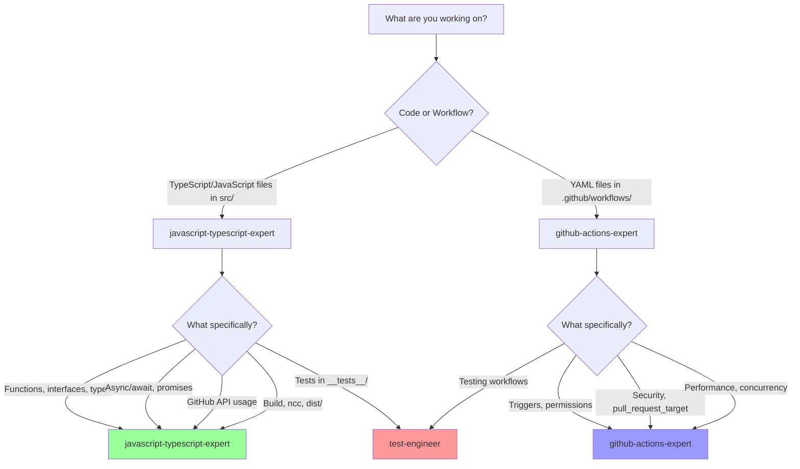
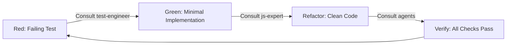
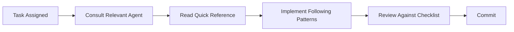

# Specialized Agent System for contributor-assistant_github-action

Version 1.0.0

---

## Overview

This project uses **domain-expert agents** to guide development, code Review, and maintenance of the contributor-assistant_github-action (CLA GitHub Action). Each agent is a specialized consultant with deep expertise in their domain.

## Available Agents

| Agent | Expertise | Lines | Consult When |
|-------|-----------|-------|--------------|
| **[javascript-typescript-expert](javascript-typescript-expert.md)** | TypeScript, async patterns, GitHub Actions Core API, ncc bundling | ~900 | Writing/reviewing src/ code, async/await, error handling, build process |
| **[github-actions-expert](github-actions-expert.md)** | Workflow security, pull_request_target, permissions, triggers, performance | ~950 | Creating/modifying workflows, security review, optimization |

**Total Guidance**: ~1,850 lines

---

## Quick Decision Matrix

### "Which agent should I consult?"



### Common Scenarios

| I Need To... | Consult Agent(s) | In This Order |
|-------------|------------------|---------------|
| Fix a bug in signature validation | javascript-typescript-expert | 1. JS expert for code 2. Test engineer for tests |
| Add new workflow trigger | github-actions-expert | 1. Workflow expert for design 2. JS expert for code support |
| Optimize API calls | javascript-typescript-expert, github-actions-expert | 1. JS expert for code 2. Workflow expert for caching |
| Review pull request | javascript-typescript-expert, github-actions-expert | 1. Both agents for respective domains |
| Add new feature | javascript-typescript-expert, github-actions-expert | 1. JS expert for implementation 2. Workflow expert for integration |
| Debug workflow failure | github-actions-expert, javascript-typescript-expert | 1. Workflow expert for logs 2. JS expert for code |
| Improve test coverage | javascript-typescript-expert | 1. Test engineer 2. JS expert for implementation |
| Update documentation | N/A (future) | Documentation specialist (not yet created) |
| Security review | github-actions-expert, javascript-typescript-expert | 1. Workflow expert for permissions 2. JS expert for secrets handling |

---

## Agent Roles

### javascript-typescript-expert

**Role**: Senior JavaScript/TypeScript developer

**Specialty**:
- TypeScript code quality in src/
- Async/await patterns and error handling
- GitHub Actions Core API (`@actions/core`, `@actions/github`)
- Build process (ncc bundling, dist/ distribution)
- Testing with Jest

**Use For**:
- Reviewing code changes in src/
- Implementing new features
- Refactoring async code
- Optimizing GitHub API usage
- Debugging TypeScript errors
- Build and distribution issues

**Output Style**: Technical code reviews, specific line-level recommendations, TypeScript patterns

---

### github-actions-expert

**Role**: GitHub Actions workflow specialist

**Specialty**:
- Workflow security (pull_request_target, permissions)
- Trigger configuration and event filtering
- Performance optimization (caching, concurrency)
- Job summaries and annotations
- CodeQL security analysis

**Use For**:
- Creating new workflows
- Modifying .github/workflows/ files
- Security reviews (especially pull_request_target)
- Optimizing workflow runs and costs
- Debugging workflow triggers
- Implementing concurrency controls

**Output Style**: Workflow-level analysis, security assessments, YAML configuration recommendations

---

## How to Use Agents

### 1. Before Starting Work

**Read the relevant agent's "5-Minute Quick Reference"** section:
- Pre-flight checklist
- Key responsibilities
- Critical patterns to follow

### 2. During Implementation

**Consult agent sections as needed**:
- Review "Key Patterns & Anti-Patterns" for guidance
- Check "Common Issues & Solutions" if stuck
- Follow "Code Review Checklist" before committing

### 3. Before Pull Request

**Complete agent review checklist**:
- Run through agent's review checklist
- Verify all "DO" patterns followed
- Ensure no "DON'T" anti-patterns present
- Get virtual "sign-off" from relevant agents

### 4. Example Workflow

**Scenario**: Adding GraphQL query to reduce API calls

```markdown
1. **Planning Phase**
   - Consult: javascript-typescript-expert § "Performance Considerations"
   - Decision: Use GraphQL for batch fetching committers

2. **Implementation Phase**
   - Follow: javascript-typescript-expert § "Async Error Handling"
   - Implement: src/graphql/batchFetchCommitters.ts
   - Pattern: Proper try/catch, typed interfaces

3. **Testing Phase**
   - Consult: test-engineer (future agent)
   - Create: __tests__/batchFetchCommitters.test.ts
   - Verify: Coverage >80%

4. **Workflow Integration**
   - Consult: github-actions-expert § "Performance"
   - Verify: No additional permissions needed
   - Check: Rate limit implications

5. **Pre-PR Review**
   - javascript-typescript-expert checklist: ✅ All checks pass
   - github-actions-expert checklist: ✅ No workflow changes needed
   - Ready for human review
```

---

## Agent Development Philosophy

### Test-Driven Development (TDD)



1. **Red**: Write failing test first (test-engineer guidance)
2. **Green**: Implement minimal code to pass (javascript-typescript-expert patterns)
3. **Refactor**: Clean up while keeping tests green (javascript-typescript-expert review)
4. **Verify**: Run all agent checklists

### Collaborative Review Process

**For Each Pull Request**:

1. **Author Self-Review** (Using Agents)
   - [ ] javascript-typescript-expert checklist complete
   - [ ] github-actions-expert checklist complete (if workflows changed)
   - [ ] All tests pass (`npm test`)
   - [ ] Build successful (`npm run build`)
   - [ ] Documentation updated

2. **Agent-Driven Review** (Automated or Manual)
   - Run code against agent patterns
   - Identify anti-patterns
   - Generate review comments

3. **Human Review** (Team Members)
   - Focus on business logic and design decisions
   - Agents handle code quality and best practices
   - Faster reviews due to pre-validated code quality

---

## Coverage Map

### What Agents Cover

| Area | Agent | Coverage |
|------|-------|----------|
| **src/ TypeScript Code** | javascript-typescript-expert | ✅ Full coverage |
| **.github/workflows/ YAML** | github-actions-expert | ✅ Full coverage |
| **Testing Strategy** | Future: test-engineer | ⚠️ Partial (via JS expert) |
| **Documentation** | Future: documentation-specialist | ❌ Not covered |
| **Security & Compliance** | github-actions-expert | ⚠️ Partial (workflow security) |
| **Build & Distribution** | javascript-typescript-expert | ✅ Full coverage |

### What's Not Covered (Future Agents)

- **test-engineer**: Comprehensive testing strategy, mocking patterns, coverage analysis
- **documentation-specialist**: Technical writing, API docs, user guides
- **security-compliance-specialist**: Vulnerability scanning, audit logging, compliance

---

## Output Formats

### Code Review Format

Agents produce structured reviews:

```markdown
## [Agent Name] Review

### [Category] Issues
❌ Line 45: [Specific issue]
   Recommendation: [How to fix]

✅ [What's done well]

⚠️ [Warnings/suggestions]

### Summary
- Critical Issues: {count}
- Warnings: {count}
- Recommendations: {count}

### Next Steps
1. [Action item 1]
2. [Action item 2]
```

### Improvement Proposals

```markdown
## Proposed: [Feature/Optimization Name]

**Problem**: [What needs improvement]
**Current State**: [How it works now]
**Proposed Solution**: [Detailed implementation]
**Benefits**: [Quantified improvements]
**Tradeoffs**: [Honest assessment]
**Recommendation**: [Implement/defer/reject with reasoning]
```

---

## Best Practices

### DO: Consult Before Implementing



**Why**: Prevents rework, ensures best practices from the start

### DO: Use Cross-Agent Collaboration

**Example**: Optimizing GitHub API calls
1. **javascript-typescript-expert**: Review code for API call patterns
2. **github-actions-expert**: Check if workflow caching can help
3. **Combined**: Implement code optimization + workflow caching

### DON'T: Skip Agent Review for "Small" Changes

**Even small changes** should follow agent patterns:
- Fixing typo in error message → Review error handling pattern
- Adding one line → Ensure it follows existing patterns
- Quick hotfix → Especially important to avoid introducing bugs

### DO: Update Agents as Project Evolves

**Agents should reflect current practices**:
- New patterns discovered → Add to agent
- Anti-patterns identified → Document in "DON'T" section
- Tools changed → Update agent guidance

---

## Integration with GitHub Copilot

These agents are designed to work with **GitHub Copilot coding agent**:

### In VS Code

1. **Invoke agent**: Tag `@workspace` in Copilot Chat
2. **Reference agent**: "Review this code following javascript-typescript-expert patterns"
3. **Get recommendations**: Copilot uses agent guidance in responses

### In Pull Requests

1. **PR description**: Reference checklist from relevant agent
2. **Review comments**: Cite agent patterns when requesting changes
3. **Approval**: Confirm agent checklists completed

---

## Metrics & Success Criteria

### Agent Effectiveness

Track these metrics to measure agent value:

- **Pre-PR issues caught**: Issues found via agent review before human review
- **Review time reduction**: Time saved in human reviews due to agent pre-validation
- **Pattern consistency**: Reduction in "style/pattern" review comments
- **Bug reduction**: Fewer bugs in production (especially async errors, security issues)

### Agent Quality

Evaluate agent quality by:

- **Actionability**: Can developers easily follow agent guidance?
- **Accuracy**: Do agent recommendations reflect best practices?
- **Coverage**: Are all common scenarios covered?
- **Discoverability**: Can developers quickly find relevant guidance?

---

## Maintenance

### Quarterly Review

**Every 3 months**, review and update agents:

1. **Pattern Evolution**: Have new best practices emerged?
2. **Tool Updates**: GitHub Actions, TypeScript, dependencies updated?
3. **Gap Analysis**: What issues are agents missing?
4. **Feedback**: What developer feedback on agent usefulness?

### After Major Incidents

**When bugs reach production**:

1. **Root Cause**: What pattern was missed?
2. **Agent Update**: Add anti-pattern to prevent recurrence
3. **Validation**: Would updated agent have caught the issue?

---

## Getting Started

### For New Contributors

1. **Read**: [GETTING_STARTED.md](GETTING_STARTED.md) - 7-day onboarding plan
2. **Consult**: Relevant agent's "5-Minute Quick Reference"
3. **Follow**: Agent patterns in your first PR
4. **Ask**: Questions in PR if agent guidance unclear

### For Maintainers

1. **Enforce**: Agent checklists in PR reviews
2. **Update**: Agents when new patterns emerge
3. **Educate**: Point contributors to relevant agent sections
4. **Measure**: Track agent effectiveness metrics

---

## Quick Reference Card

**Print this for your desk**:

```
╔══════════════════════════════════════════════════════════╗
║   CONTRIBUTOR-ASSISTANT AGENT QUICK REFERENCE            ║
╠══════════════════════════════════════════════════════════╣
║                                                          ║
║  📝 TypeScript Code (src/)                               ║
║     → javascript-typescript-expert.md                    ║
║     Focus: Async, types, error handling, build          ║
║                                                          ║
║  ⚙️  Workflows (.github/workflows/)                      ║
║     → github-actions-expert.md                           ║
║     Focus: Security, triggers, permissions              ║
║                                                          ║
║  📋 Before Committing:                                   ║
║     ✅ Agent checklist complete                          ║
║     ✅ npm test passes                                   ║
║     ✅ npm run build succeeds                            ║
║     ✅ dist/ updated and committed                       ║
║                                                          ║
║  🚨 Security: ALWAYS consult github-actions-expert       ║
║     when using pull_request_target                      ║
║                                                          ║
╚══════════════════════════════════════════════════════════╝
```

---

## Questions or Feedback?

- **Agent unclear?** Open issue: "Agent guidance needed: [topic]"
- **Pattern missing?** PR to update agent with new pattern
- **Agent wrong?** Please report - agents should reflect current best practices

---

**Version History**:
- v1.0.0 (2024): Initial agent system with JS/TS and GitHub Actions experts

**Next Planned Agents**:
- test-engineer (testing strategy, mocking, coverage)
- documentation-specialist (technical writing, user guides)
- security-compliance-specialist (vulnerability scanning, audit compliance)
