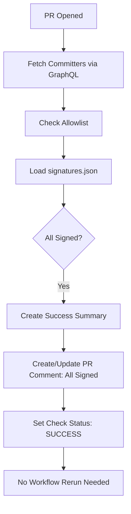
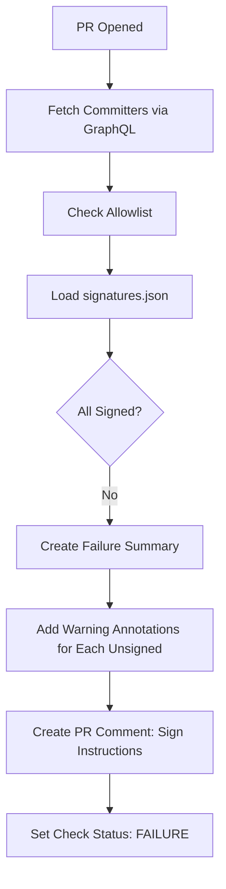
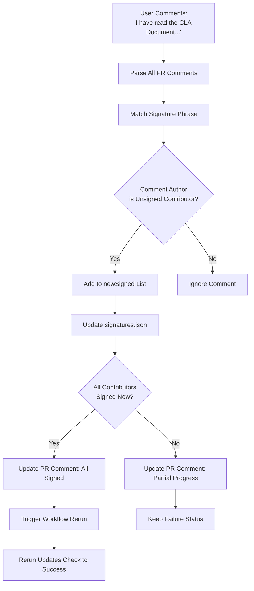
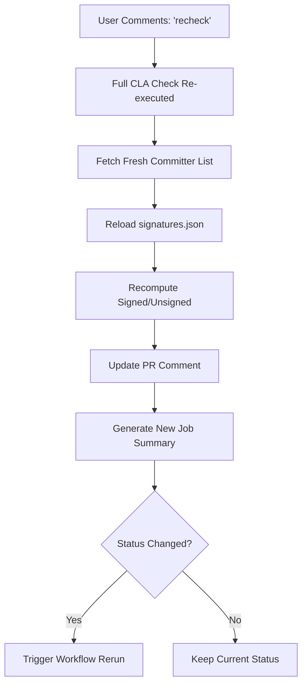
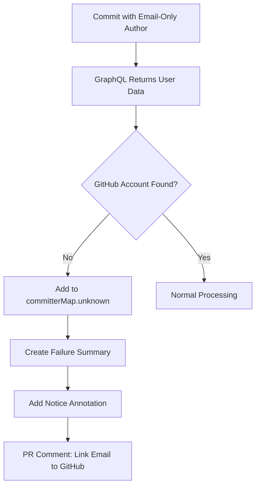

# CLA Assistant Lite - Execution Paths & Use Cases

## Table of Contents
- [Use Case Matrix](#use-case-matrix)
- [Detailed Execution Paths](#detailed-execution-paths)
- [Comment Interactions](#comment-interactions)
- [Edge Cases](#edge-cases)
- [State Transitions](#state-transitions)

## Use Case Matrix

| Scenario | Trigger Event | Contributors Status | Action Taken | Check Result | PR Comment | Job Summary |
|----------|---------------|---------------------|--------------|--------------|------------|-------------|
| **New PR - All Signed** | `pull_request_target.opened` | All previously signed | None | ✅ Success | "All contributors have signed" | Success table with contributors |
| **New PR - Some Unsigned** | `pull_request_target.opened` | Mix of signed/unsigned | Create comment | ❌ Failure | List unsigned, show sign instructions | Failure list with annotations |
| **New PR - All Unsigned** | `pull_request_target.opened` | None signed | Create comment | ❌ Failure | List all unsigned | Failure list with annotations |
| **Push to PR** | `pull_request_target.synchronize` | Status unchanged | Update comment | Same as before | Updated list | Updated summary |
| **New Committer Added** | `pull_request_target.synchronize` | New unsigned contributor | Update comment | ❌ Failure | Add to unsigned list | Updated failure list |
| **Contributor Signs** | `issue_comment.created` | One signs via comment | Update signatures.json | ❌→✅ (if last) | Update comment | Trigger rerun |
| **Partial Signing** | `issue_comment.created` | Some sign, others remain | Update signatures.json | ❌ Failure | Update lists | Updated failure list |
| **Recheck Command** | `issue_comment.created` ("recheck") | Any | Re-validate entire PR | Current status | Update comment | Fresh summary |
| **Allowlist Match** | `pull_request_target.opened` | All match allowlist | None | ✅ Success | "All contributors have signed" | Success summary |
| **Domain Allowlist** | `pull_request_target.opened` | Email domains match | None | ✅ Success | "All contributors have signed" | Success summary |
| **Unknown GitHub User** | `pull_request_target.opened` | Email-only commits | Create comment | ❌ Failure | Special notice for unknown users | Failure + unknown user notice |
| **PR Closed/Merged** | `pull_request_target.closed` | Any (if lock enabled) | Lock PR conversation | N/A | Lock comment added | None |

## Detailed Execution Paths

### Path 1: New Pull Request - All Contributors Signed



**Code Path:**
1. `main.ts:run()` → `setupClaCheck.ts:setupClaCheck()`
2. `getCommitters()` - GraphQL query for commit authors
3. `checkAllowList()` - Filter allowlisted users
4. `getCLAFileContentandSHA()` - Load signatures from remote repo
5. `prepareCommiterMap()` - Build signed/unsigned lists
6. `prCommentSetup()` - Create PR comment
7. `createSuccessSummary()` - Generate job summary
8. `core.setOutput()` - Mark check as passed

**Artifacts:**
- ✅ Check Run: "CLA-Lite / Check" - Success
- 💬 PR Comment: "All contributors have signed the CLA ✍️ ✅"
- 📊 Job Summary: Table with all contributors marked as signed

### Path 2: New Pull Request - Contributors Need to Sign



**Code Path:**
1. Same as Path 1 through `prepareCommiterMap()`
2. `committerMap.notSigned.length > 0` → Failure path
3. `createFailureSummary()` - Build failure summary with:
   - Count of unsigned contributors
   - Bulleted list with names and emails
   - Link to CLA document
   - Signing instructions
4. `core.warning()` - Create annotation for each unsigned contributor
5. `core.notice()` - Create annotation for unknown GitHub users
6. `core.setFailed()` - Mark check as failed

**Artifacts:**
- ❌ Check Run: "CLA-Lite / Check" - Failure
- 💬 PR Comment: List of unsigned contributors with instructions
- 📊 Job Summary:
  - "❌ CLA Signature Required"
  - Count: "3 of 5 contributors need to sign the CLA"
  - Bulleted list of unsigned contributors
  - Link to CLA document
  - Signing instructions
- ⚠️ Annotations: Warning on Files Changed tab for each unsigned contributor

**Example Job Summary Output:**
```
❌ CLA Signature Required
3 of 5 contributors need to sign the CLA.

### Unsigned Contributors
• @bob-developer (bob@example.com)
• @charlie-coder (charlie@test.org)
• @alice-engineer (alice@example.com)

📝 View CLA Document

To sign: Comment on this PR with "I have read the CLA Document and I hereby sign the CLA"
```

### Path 3: Contributor Signs via Comment



**Code Path:**
1. `main.ts:run()` → `setupClaCheck.ts:setupClaCheck()`
2. `prCommentSetup()` → `signatureWithPRComment()`
3. `octokit.issues.listComments()` - Fetch all PR comments
4. Filter comments matching signature regex (case-insensitive)
5. `reactedCommitters.newSigned` - Contributors who just signed
6. `updateFile()` - Commit new signatures to signatures.json
7. `prepareCommiterMap()` - Update signed/unsigned lists
8. `updateComment()` - Update PR comment with new status
9. If all signed: `reRunLastWorkFlowIfRequired()` - Trigger rerun

**Signature Matching:**
- Regex: `/^.*i \s*have \s*read \s*the \s*cla \s*document \s*and \s*i \s*hereby \s*sign \s*the \s*cla.*$/`
- Case-insensitive
- Ignores extra whitespace
- Custom phrases supported via `custom-pr-sign-comment` input

**Artifacts:**
- 📝 Signature added to signatures.json with:
  - `name`: GitHub username
  - `id`: GitHub user ID
  - `comment_id`: Comment ID where signature was posted
  - `created_at`: Timestamp
  - `repoId`: Repository ID
  - `pullRequestNo`: PR number
- 💬 PR Comment Updated:
  - If all signed: "All contributors have signed the CLA ✍️ ✅"
  - If partial: Updated count (e.g., "2 out of 3 committers have signed")
- 🔄 Workflow Rerun: If all signed, triggers new run that will pass

### Path 4: Recheck Command



**Code Path:**
- Same as Path 1/2 - complete re-validation
- Useful when:
  - Signatures were added to signatures.json externally
  - Testing CLA action changes
  - User was added to allowlist
  - Force refresh of status

**When to Use Recheck:**
1. **External Signature Addition**: Signature manually added to signatures.json
2. **Allowlist Updates**: User added to allowlist or domain-allow-list
3. **Debugging**: Force action to re-evaluate
4. **Sync Issues**: Workflow state out of sync with reality

**Best Practice:**
- Recheck is NOT needed for normal signature flow (auto-triggered)
- Useful for administrators debugging CLA issues
- Can be mentioned in PR comment for user convenience

### Path 5: Unknown GitHub Users



**Scenario:**
- Git commit has author email but no linked GitHub account
- Common causes:
  - Email not added to GitHub account
  - Committing with non-GitHub email
  - Email privacy settings

**Code Path:**
1. GraphQL returns user data with missing GitHub ID
2. `committerMap.unknown` populated
3. Special handling in `createFailureSummary()`
4. `core.notice()` annotations for each unknown user

**PR Comment Addition:**
```
@john-doe seems not to be a GitHub user. You need a GitHub account to be able to
sign the CLA. If you have already a GitHub account, please add the email address
used for this commit to your account.
```

**Resolution:**
1. User adds email to GitHub account: Settings → Emails
2. Recheck triggered
3. User now recognized, can sign CLA

## Comment Interactions

### Current Behavior

#### On "recheck" Comment
**Action:** Full CLA re-validation
**Response:** Updates PR comment and job summary
**Status Change:** Possible (if signatures changed)
**Comment Reaction:** ❌ **NOT IMPLEMENTED** - No emoji reaction on recheck comment

#### On Signature Comment
**Action:** Record signature, update status
**Response:** Update PR comment with new signed/unsigned lists
**Status Change:** Yes (if all now signed → triggers rerun)
**Comment Reaction:** ❌ **NOT IMPLEMENTED** - No emoji reaction on signature comment

### Best Practice Recommendations

#### Option 1: React to Comments (RECOMMENDED)
Add emoji reactions to provide immediate feedback:

```typescript
// After successful signature
await octokit.reactions.createForIssueComment({
  owner: context.repo.owner,
  repo: context.repo.repo,
  comment_id: signatureCommentId,
  content: '+1' // or 'hooray'
})

// After recheck
await octokit.reactions.createForIssueComment({
  owner: context.repo.owner,
  repo: context.repo.repo,
  comment_id: recheckCommentId,
  content: 'eyes' // indicates processing
})
```

**Benefits:**
- Immediate user feedback
- Confirms comment was recognized
- Professional UX

#### Option 2: Reply Comments (ALTERNATIVE)
Post reply comments to confirm action:

```typescript
await octokit.issues.createComment({
  owner: context.repo.owner,
  repo: context.repo.repo,
  issue_number: context.issue.number,
  body: `@${username} Thank you for signing the CLA! ✅`
})
```

**Tradeoffs:**
- Pros: Clear, explicit confirmation
- Cons: Clutters PR conversation

#### Current Implementation: Silent Updates
- ✅ Updates PR comment with signatures
- ✅ Generates job summary
- ✅ Triggers workflow rerun (if all signed)
- ❌ No direct response to user comment
- ❌ User must check PR comment or workflow run to confirm

**Recommendation:** Add emoji reactions (Option 1) for better UX without cluttering conversation.

## Edge Cases

### Case 1: Multiple Signatures in One Comment
**Scenario:** User posts signature comment multiple times
**Behavior:** Only first signature recorded (by `comment_id`)
**Outcome:** Duplicate signatures prevented by user ID matching

### Case 2: Non-Contributor Signs
**Scenario:** Random user posts signature comment
**Behavior:** Comment ignored - not in contributors list
**Outcome:** No signature recorded

### Case 3: Bot Commits
**Scenario:** dependabot, renovate, etc. create commits
**Behavior:** Matched against allowlist, bypassed if listed
**Outcome:** No CLA required for allowlisted bots

### Case 4: Co-Authors
**Scenario:** Commit has multiple authors via `Co-authored-by:`
**Behavior:** GraphQL extracts all co-authors
**Outcome:** All co-authors must sign CLA

**Example Commit:**
```
feat: Add new feature

Co-authored-by: Alice <alice@example.com>
Co-authored-by: Bob <bob@example.com>
```
**Result:** Main author, Alice, and Bob all checked for CLA

### Case 5: Force Push / Rebase
**Scenario:** PR commits rewritten, different commit SHAs
**Behavior:** Committers re-evaluated on `synchronize` event
**Outcome:** Existing signatures remain valid (matched by user ID, not commit SHA)

### Case 6: Allowlist Pattern Matching
**Scenario:** `allowlist: bot-*, *[bot]`
**Behavior:** Wildcard pattern matching on username
**Outcome:** `bot-deploy`, `renovate[bot]` bypassed

**Pattern Types:**
- Exact: `username` - Must match exactly
- Prefix wildcard: `*-bot` - Matches `renovate-bot`, `release-bot`
- Suffix wildcard: `bot-*` - Matches `bot-deploy`, `bot-test`
- Universal: `*` - Matches anything (NOT RECOMMENDED)

### Case 7: Domain Allowlist
**Scenario:** `domains.json` contains `@company.com`
**Behavior:** Any commit with `*@company.com` email bypassed
**Outcome:** Corporate contributors auto-signed

**Security Note:** Use domain allowlist only for trusted corporate domains.

## State Transitions

### Check Status State Machine

```
┌─────────────┐
│   PENDING   │ (Initial state on PR open)
└──────┬──────┘
       │
       ▼
   ┌───────────┐
   │ EVALUATE  │ (Fetch committers, check signatures)
   └─────┬─────┘
         │
     ┌───┴────┐
     │        │
     ▼        ▼
┌─────────┐ ┌──────────┐
│ SUCCESS │ │ FAILURE  │
└────┬────┘ └────┬─────┘
     │           │
     │           ▼
     │      ┌──────────────┐
     │      │ AWAIT        │ (Wait for signatures)
     │      │ SIGNATURES   │
     │      └────┬─────────┘
     │           │
     │    ┌──────┴──────┐
     │    │             │
     │    ▼             ▼
     │ ┌───────┐   ┌──────────┐
     │ │ SIGN  │   │ RECHECK  │
     │ └───┬───┘   └────┬─────┘
     │     │            │
     │     └────────────┘
     │            │
     │            ▼
     │      ┌──────────┐
     │      │ EVALUATE │ (Re-validate)
     │      └────┬─────┘
     │           │
     │       ┌───┴────┐
     │       │        │
     │       ▼        ▼
     └──► SUCCESS   FAILURE
```

### PR Comment State Machine

```
┌─────────────────┐
│ No Comment      │ (PR just opened)
└────────┬────────┘
         │
         ▼
┌─────────────────────────────────┐
│ Create Comment                  │
│ - List unsigned contributors     │
│ - Show signing instructions      │
└────────┬────────────────────────┘
         │
    ┌────┴─────┐
    │          │
    ▼          ▼
┌─────────┐ ┌────────────┐
│ Updated │ │ Signature  │
│ Comment │ │ Added      │
│ (sync)  │ └─────┬──────┘
└────┬────┘       │
     │            ▼
     │      ┌───────────────┐
     │      │ Update Comment│
     │      │ - Move to     │
     │      │   signed list │
     │      └───────┬───────┘
     │              │
     │         ┌────┴────┐
     │         │         │
     │         ▼         ▼
     │    ┌────────┐ ┌─────────────┐
     │    │ Partial│ │ All Signed  │
     │    │ Signed │ │             │
     │    └────┬───┘ └──────┬──────┘
     │         │            │
     └─────────┘            ▼
                    ┌──────────────┐
                    │ Final Comment│
                    │ "All signed" │
                    └──────────────┘
```

## Testing & Validation

### Test PR Example
See: [rdkcentral/cmf-release-app#27](https://github.com/rdkcentral/cmf-release-app/pull/27)

**Setup:**
- 3 commits from unsigned contributors
- 2 co-authors (total 5 unsigned contributors)
- CLA workflow using `feat/enhanced-check-run-feedback` branch

**Expected Behavior:**
1. ❌ Initial check fails
2. 📊 Job summary lists all 5 unsigned contributors
3. ⚠️ 5 warning annotations on PR
4. 💬 PR comment with signing instructions
5. ✍️ Contributors post signature comments
6. 📝 signatures.json updated
7. 💬 PR comment updated with progress
8. ✅ Final signature triggers rerun → Success

### Validation Checklist
- [ ] Job summary renders HTML correctly (bold, links)
- [ ] Warning annotations appear on Files Changed tab
- [ ] PR comment formats properly
- [ ] Signature comments recognized (case-insensitive)
- [ ] signatures.json updated correctly
- [ ] Workflow rerun triggered on final signature
- [ ] Check status updates from failure to success
- [ ] No duplicate status checks ("Signature / Check" removed)

## Next Steps
- See [ENHANCED_FEEDBACK.md](./ENHANCED_FEEDBACK.md) for v2.7.0 improvements
- See [DEBUGGING_HISTORY.md](./DEBUGGING_HISTORY.md) for fixes implemented
- See [CONFIGURATION.md](./CONFIGURATION.md) for deployment guide
